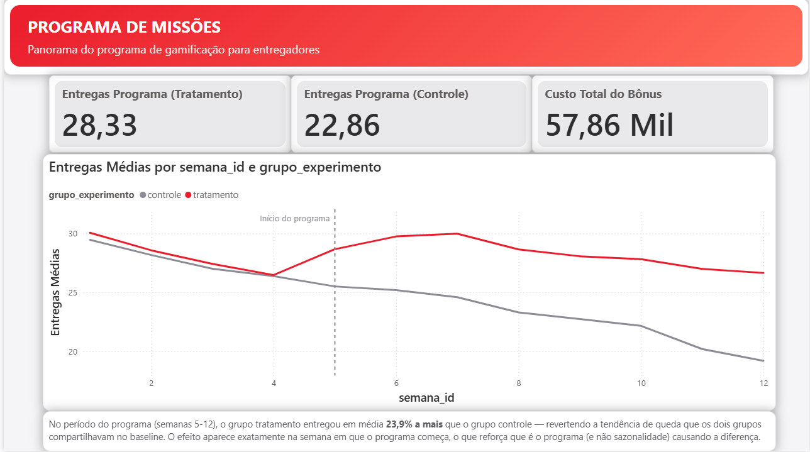

# Programa de Missões (Gamificação) para Entregadores
> Case de BI: teste controlado de um programa de incentivo financeiro com gamificação, simulando um cenário real de operação de delivery — do problema de negócio ao dashboard e recomendação final.
 
## 🎯 O problema
Uma operação de delivery quer saber se vale a pena escalar um programa de incentivo com gamificação para entregadores: missões semanais com metas de entrega, pagando um bônus em dinheiro quando a meta é batida. A pergunta central: o programa realmente muda o comportamento dos entregadores, ou quem participa já seria mais produtivo de qualquer forma? Para responder isso, o programa rodou como um experimento controlado — não como um lançamento geral — permitindo isolar o efeito real do incentivo.
 
## 🔍 Hipóteses investigadas
| # | Hipótese |
|---|---|
| H1 | O programa aumenta o número de entregas/semana do grupo tratamento vs. controle |
| H2 | O programa reduz o churn (evasão) dos entregadores |
| H3 | Algum tier de missão está descalibrado (fácil ou difícil demais) |
| H4 | A receita incremental gerada supera o custo do bônus pago (ROI positivo) |
 
## 🗂️ Modelo de dados
Modelo estrela com 5 tabelas: `dim_entregadores`, `dim_semana`, `dim_missoes`, `fato_atividade_semanal`, `fato_incentivos`.
 
Desenho do experimento: 400 entregadores, divididos em grupo controle e tratamento. 4 semanas de baseline (nenhum grupo recebe missão) + 8 semanas de programa (só o tratamento recebe missões) — desenho que permite uma análise diff-in-diff, comparando a variação de cada grupo antes/depois, não só o nível final.
 
## 🛠️ Stack utilizada
`SQL (SQLite)` · `Power BI` · `DAX` · `Python` (geração do dataset sintético)
 
## 📊 O que os dados mostraram
 
**H1 — Volume de entregas ✅ confirmada**
No período do programa (semanas 5–12), o grupo tratamento entregou em média **28,33 entregas/semana**, contra **22,86** do grupo controle — uma diferença de **23,9%**. No baseline (semanas 1–4), os dois grupos tinham trajetórias praticamente idênticas, inclusive de leve queda. A separação das curvas acontece exatamente na semana em que o programa começa, o que reforça uma relação causal, não apenas uma correlação com sazonalidade.
 

**A VALIDAR:**

**H2 — Retenção**
*(análise estruturada nas queries do repositório — comparação da taxa de entregadores ativos por fase/grupo — resultado a preencher com a execução final)*
 
**H3 — Calibração dos tiers**
*(taxa de conclusão por tier de missão, Bronze/Prata/Ouro — estrutura de análise pronta em `sql/02_queries_iniciais.sql`)*
 
**H4 — ROI**
*(receita incremental estimada vs. custo total do bônus pago — lógica documentada, pronta para ser fechada com os dados completos)*
 
## 💡 Recomendação
Com base na H1 confirmada, o programa demonstra efeito causal real sobre a produtividade dos entregadores no período testado, justificando um piloto em escala maior antes de uma decisão de rollout completo — idealmente acompanhado do fechamento das análises de retenção, calibração de tiers e ROI, que indicam se o ganho de entregas se sustenta financeiramente e operacionalmente.
 
## 📁 Como reproduzir
1. Clone o repositório
2. Importe os CSVs de `data/` num banco SQLite (scripts em `sql/`)
3. Abra o dashboard no Power BI Desktop e aponte a conexão para o seu banco local
## ⚠️ Observação sobre os dados
Os dados usados neste case são **sintéticos**, gerados para simular de forma realista o comportamento de um programa de gamificação em uma operação de delivery — não representam dados reais de nenhuma empresa.
 
---
*Case desenvolvido por Camille Porto de Sousa como parte de portfólio para vagas de BI.*
